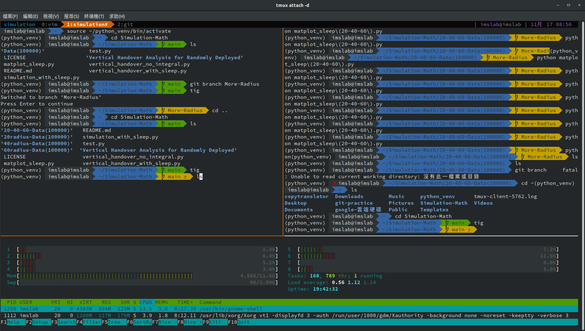

# Environment
ubuntu 18.04 

# Get Started

- git clone --recursive https://github.com/reverie0829/My_vimrc.git
- cd My_vimrc
- cp vimrc ~/.vimrc
- mv vim ~/.vim
- ```
    curl -fLo ~/.vim/autoload/plug.vim --create-dirs \
    https://raw.githubusercontent.com/junegunn/vim-plug/master/plug.vim
  ```
- vim
- :PluginInstall
- Modify the `Plugin Settings` in ~/.vimrc

# Troubleshooting

**Taglist: Exuberant ctags (http://ctags.sf.net) not found in PATH. Plugin is not loaded.**

Reason: ctags is missing
```
sudo apt-get install ctags
```

# Use Shell Script to Set Up  ( Recommend )

- cd My_vimrc
- sudo ./vimConfig.sh